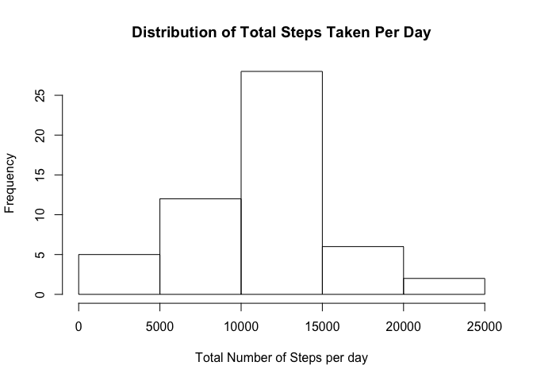
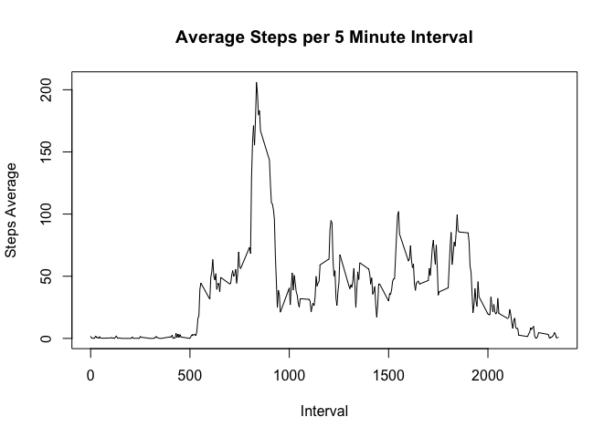

Let's start by loading all the needed libraries.


```r
library(lattice)
library(ggplot2)
library(lubridate)
```

```
## 
## Attaching package: 'lubridate'
```

```
## The following object is masked from 'package:base':
## 
##     date
```

```r
library(xtable)
library(plyr)
```

```
## 
## Attaching package: 'plyr'
```

```
## The following object is masked from 'package:lubridate':
## 
##     here
```


## Loading and preprocessing the data

Unzip and read the data into R.

```r
unzip("activity.zip")
activity <- read.table("activity.csv", header=TRUE, sep=",", na.strings="NA")
```

Take a quick look at the data.

```r
str(activity)
```

```
## 'data.frame':	17568 obs. of  3 variables:
##  $ steps   : int  NA NA NA NA NA NA NA NA NA NA ...
##  $ date    : Factor w/ 61 levels "2012-10-01","2012-10-02",..: 1 1 1 1 1 1 1 1 1 1 ...
##  $ interval: int  0 5 10 15 20 25 30 35 40 45 ...
```

Convert the `data` column in the dataset to date values.

```r
activity$date <- ymd(activity$date)
str(activity)
```

```
## 'data.frame':	17568 obs. of  3 variables:
##  $ steps   : int  NA NA NA NA NA NA NA NA NA NA ...
##  $ date    : Date, format: "2012-10-01" "2012-10-01" ...
##  $ interval: int  0 5 10 15 20 25 30 35 40 45 ...
```


## What is mean total number of steps taken per day?

Make a histogram of the total number of steps taken each day.

```r
steps.date <- aggregate(steps ~ date, data = activity, FUN = sum)
hist(steps.date$steps, main="Distribution of Total Steps Taken Per Day", xlab="Total Number of Steps per day")
```

<!-- -->


```r
barplot(steps.date$steps, names.arg = steps.date$date, xlab = "Date", ylab = "Steps")
```

<!-- -->


Calculate and report the **mean** and **median** total number of steps taken per day.

```r
mean(steps.date$steps)
```

```
## [1] 10766.19
```

```r
median(steps.date$steps)
```

```
## [1] 10765
```

## What is the average daily activity pattern?

1. Make a time series plot of the 5-minute interval(x-axis) and the average number of steps taken, average across all days(y-axis).

```r
steps_interval <- aggregate(steps ~ interval, data=activity, FUN=mean)
plot(steps_interval, type="l",main="Average Steps per 5 Minute Interval", xlab="Interval", ylab="Steps Average")
```

<!-- -->

2. Find the interval with the highest average number of steps.

```r
max <- max(steps_interval$steps)
max_interval <- steps_interval$interval[which.max(steps_interval$steps)]
cat(sprintf("Maximum average is %.2f which occurs on the %.0f 5-minute interval", max, max_interval))
```

```
## Maximum average is 206.17 which occurs on the 835 5-minute interval
```

The 5-minute interval that, on average, contains the maximum number of steps is the **835** interval with the maximum average of **206.1698113** steps.

## Imputing missing values
1. Count the total number of missing values.

```r
totalNA <- sum(is.na(activity[,1]))
```
There are a total of **2304** rows with `NA` entries. 


2. Devise a strategy for filling in all of the missing values in the dataset. 

Missing values will be imputed by setting them equal to the mean for that interval across all days. These mean values were calculated earlier. A new data set including imputed values will be generated.

3.Create a new dataset that is equal to the original dataset but with the missing data filled in.


```r
stepsNew <- numeric(length=nrow(activity))
for (r in 1:nrow(activity)) {
    if (is.na(activity[r, 1])) {
        missingInterval <- activity[r, 3]
        stepsNew[r] <- steps_interval[which(steps_interval[,1]==missingInterval),2]
    } else {
        stepsNew[r] <- activity[r,1]
        }
}
activityNew <- cbind(stepsNew, activity[,2:3])
```

The **new dataset** has no `NAs` in it as can be seen below:

```r
head(activityNew,20)
```

```
##     stepsNew       date interval
## 1  1.7169811 2012-10-01        0
## 2  0.3396226 2012-10-01        5
## 3  0.1320755 2012-10-01       10
## 4  0.1509434 2012-10-01       15
## 5  0.0754717 2012-10-01       20
## 6  2.0943396 2012-10-01       25
## 7  0.5283019 2012-10-01       30
## 8  0.8679245 2012-10-01       35
## 9  0.0000000 2012-10-01       40
## 10 1.4716981 2012-10-01       45
## 11 0.3018868 2012-10-01       50
## 12 0.1320755 2012-10-01       55
## 13 0.3207547 2012-10-01      100
## 14 0.6792453 2012-10-01      105
## 15 0.1509434 2012-10-01      110
## 16 0.3396226 2012-10-01      115
## 17 0.0000000 2012-10-01      120
## 18 1.1132075 2012-10-01      125
## 19 1.8301887 2012-10-01      130
## 20 0.1698113 2012-10-01      135
```

Compared to the **old dataset** which still has `NAs` in it:

```r
head(activity,20)
```

```
##    steps       date interval
## 1     NA 2012-10-01        0
## 2     NA 2012-10-01        5
## 3     NA 2012-10-01       10
## 4     NA 2012-10-01       15
## 5     NA 2012-10-01       20
## 6     NA 2012-10-01       25
## 7     NA 2012-10-01       30
## 8     NA 2012-10-01       35
## 9     NA 2012-10-01       40
## 10    NA 2012-10-01       45
## 11    NA 2012-10-01       50
## 12    NA 2012-10-01       55
## 13    NA 2012-10-01      100
## 14    NA 2012-10-01      105
## 15    NA 2012-10-01      110
## 16    NA 2012-10-01      115
## 17    NA 2012-10-01      120
## 18    NA 2012-10-01      125
## 19    NA 2012-10-01      130
## 20    NA 2012-10-01      135
```

4. Make a histogram of the total number of steps taken each day and Calculate and report the **mean** and **median** total number of steps taken per day. 

```r
steps_new <- aggregate(stepsNew ~ date, data = activityNew, FUN = sum)
hist(steps_new$stepsNew, main="Distribution of Total Steps Taken Per Day", xlab="Total Number of Steps per day")
```

<!-- -->

```r
mean1 <- mean(steps_new$stepsNew)
median1 <- median(steps_new$stepsNew)
```

The mean of the total number of steps taken per day is **10766** while the median is **10766**.  
**The mean and the median values didn't change when imputing the missing values.**

## Are there differences in activity patterns between weekdays and weekends?

1. Create a new factor variable in the dataset with two levels – “weekday” and “weekend” indicating whether a given date is a weekday or weekend day.

```r
activityNew$weekday <- weekdays(activityNew$date)
## Function to factor weekdays in weekend and weekdays
dayofweek <- function(x){
        if(weekdays(x)=="Satruday" | weekdays(x)=="Sunday"){
                return("Weekend")
        }else{return("Weekday")}
}
## add new weekend/weekday factor to the dataframe
activityNew$daytype <- as.factor(sapply(activityNew$date, FUN=dayofweek))
```

2. Make a panel plot containing a time series plot of the 5-minute interval (x-axis) and the average number of steps taken, averaged across all weekday days or weekend days (y-axis).

```r
par(mfrow = c(2, 1))
for (type in c("Weekend", "Weekday")) {
        steps_type <- aggregate(stepsNew ~ interval, data = activityNew, subset = activityNew$daytype == type, FUN = mean)
        plot(steps_type, type = "l", main = type,xlab="Interval", ylab="Steps Average")
}
```

<!-- -->

From the plot above, it is clear that there is a difference in the activities between the weekend and weekdays.
